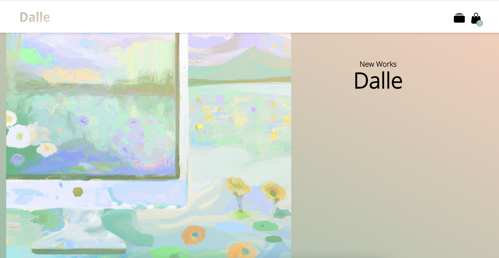
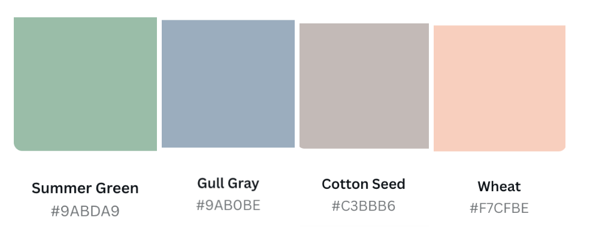
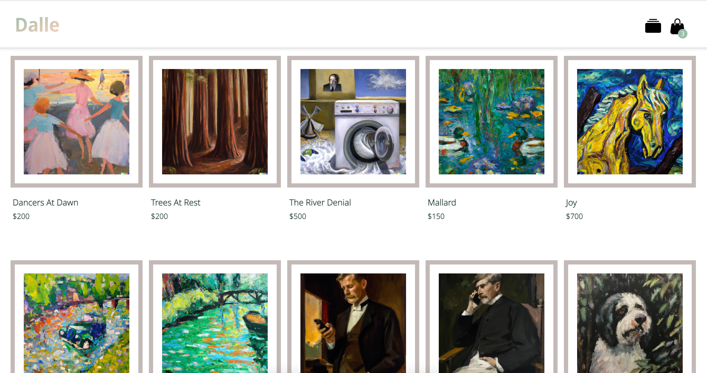
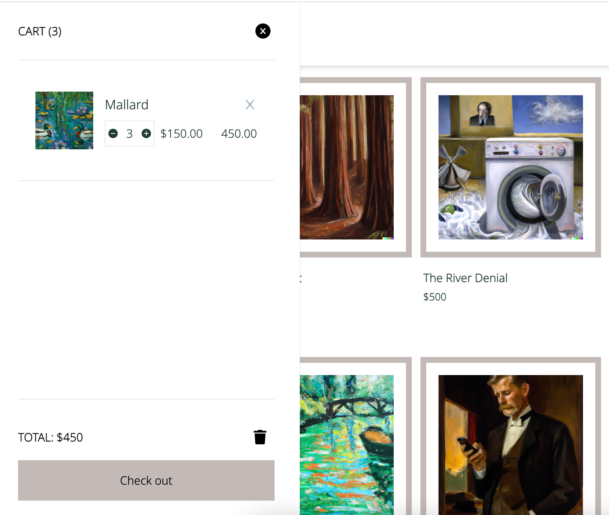

<h1 align="center"> 

Dalle is an AI generated e-commerce art website that allows users to add and remove art pieces to and from a cart.

</h1>

<h2 align="center">Creator:</h2>

Meg Divringi 
 
(<a href="https://dev.to/megdiv">Blog</a>, <a href="https://github.com/Meg-Div">GitHub</a>)

Meg created Dalle (a solo project) while enrolled within the Web Developer program at DigitalCrafts. 

---

<h2 align="center">Languages/ Technologies Used:</h2>

Javascript
* React
* Redux
* TypeScript
* TailwindCSS
* React Router
* DALL·E 2
* Canva
* Jira
* Figma

---

<h2 align="center">Palette:</h2>

---

<h2 align="center">View:</h2>

To view the project in full, head to my portfolio: (<a href="https://meg-div.github.io/">Meg's Portfolio</a>)
  
To read the project blog, head to: (<a href="https://dev.to/megdiv/dalle-14ca">Project Blog</a>)
  

 
 

 
 

---
