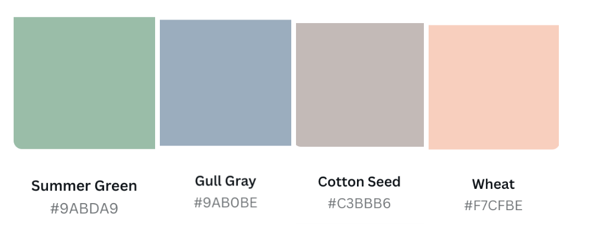

# React-Project

Update to readme

Project Requirements

- React / Redux

- Reducers, Actions, Action types all split up into their own seperate files, use combineReducers

- React Router

- Mobile responsive. You will have to make sure your application is mobile responsive to a testable level. You can't account for all of the resolution sizes but you can account for the top 3, Desktop, tablet, phone. Please make sure your application works appropriately when sized to these resolutions.

- Completely styled from start to finish. You will need to have a concise theme and styling done for this website. This is to be the prettiest application you have ever made up to this point. You can use any framework or style it all yourself.
  You will use a 3rd party api if you are not doing a e-commerce store. This api needs to make sense for the application you are creating and not just there for the sake of using an API. Think of using a charting framework to show data for a specific city, or to find hotspots during certain times of the day for a certain location. These are just a few suggestions, but you need to make use of data that is coming in from another source.

- If you are using this for a e-commerce store, you can load your own data into your application. This data must be read from the redux store.
  Medium article

- Enough components that it makes sense. If you can create more components because you have too many features in one component, I would advise you split them up.
  Color swatches for the design of your website. Go to https://www.canva.com/colors/color-palette-generator/ for inspiration for your design.

- Create a 404 not found error component that renders whenever the user enters or navigates to something that is not a correct route or error.

<h1 align="center"> 

</h1>

 

Dalle is an AI generated e-commerce art website which allows users to add and remove art pieces to and from a cart. 

---

<h2 align="center">Creator:</h2>

Meg Divringi 
 
(<a href="https://dev.to/megdiv">Blog</a>, <a href="https://github.com/Meg-Div">GitHub</a>)

Meg created Dalle (a solo project) while enrolled within the Web Developer program at DigitalCrafts. 

---

<h2 align="center">Languages/ Technologies Used:</h2>

Javascript
* React
* Redux
* TypeScript
* TailwindCss
* React Router
* Canva
* Jira
* Figma

---

<h2 align="center">Use/View:</h2>
To view the project, head to their portfolios: (<a href="https://meg-div.github.io/">Meg's Portfolio</a>)
  
To read the project blog, head to: <a href="https://dev.to/megdiv/dalle-14ca"> Project Blog</a>
  

<h1 align="center"> 

</h1>

 

 
 

